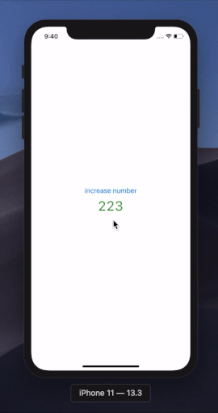

 # react-native-animated-numbers

 [](https://github.com/heyman333/react-native-animated-numbers/pulls)
[](http://facebook.github.io/react-native/)
[](https://github.com/heyman333/react-native-animated-numbers/blob/master/LICENSE)

<a href="https://www.npmjs.com/package/react-native-animated-numbers">

</a>
<a href="https://www.npmjs.com/package/react-native-animated-numbers">

</a>

 Library showing animation of number changes

 ## install 
 ```shell
 yarn add react-native-animated-numbers
 # or 
 npm install react-native-animated-numbers
 ```

 ## props 
|                   |    type    |  default | description                            |
|:-----------------:|:----------:|:--------:|----------------------------------------|
|    startNumber    |   number   |   none   | Number before animation                |
|  animateToNumber  |   number   |   none   | Number to be animated                  |
|     fontStyle     | TextStyle? |   none   | Style of number text                   |
| animationDuration |   number?  | 1400(ms) | The speed at which the animation works |
|    includeComma   |  boolean?  |   false  | Whether the number contains commas     |
|       easing      |   Easing?  |   Easing.elastic(1.2)   | React Native Easing API in Animated    |

## example

```js
import React from 'react';
import AnimatedNumber from 'react-native-animated-numbers';
import {Button, View} from 'react-native';

const App = () => {
  const [animatedNumber, setAnimatedNumber] = React.useState({
    startNumber: 223,
    animatedToNumber: 223,
  });

  const increase = () => {
    setAnimatedNumber({
      startNumber: animatedNumber.animatedToNumber,
      animatedToNumber: animatedNumber.animatedToNumber + 241,
    });
  };

  return (
    <View style={{flex: 1, justifyContent: 'center', alignItems: 'center'}}>
      <Button onPress={increase} title="increase number" />
      <AnimatedNumber
        startNumber={animatedNumber.startNumber}
        animateToNumber={animatedNumber.animatedToNumber}
        fontStyle={{fontSize: 35, color: '#3e9e39'}}
        animationDuration={800}
        includeComma={true}
      />
    </View>
  );
};

export default App;

```

 ## screenshot

 
