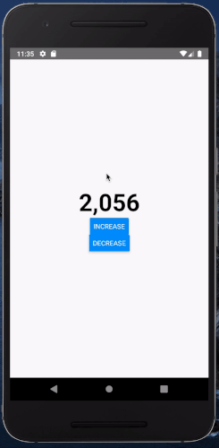

 # react-native-animated-numbers

 [](https://github.com/heyman333/react-native-animated-numbers/pulls)
[](http://facebook.github.io/react-native/)
[](https://github.com/heyman333/react-native-animated-numbers/blob/master/LICENSE)

<a href="https://www.npmjs.com/package/react-native-animated-numbers">

</a>
<a href="https://www.npmjs.com/package/react-native-animated-numbers">

</a>

 Library showing animation of number changes in react-native

 If you want web version in react.js [download react-animated-numbers](https://github.com/heyman333/react-animated-numbers)

 ## install 

This package is using [react-native-reanimated](https://docs.swmansion.com/react-native-reanimated/docs/about). So following libs should be installed first

```shell
yarn add react-native-reanimated react-native-gesture-handler && cd ios && pod install
```

next
 ```shell
 yarn add react-native-animated-numbers
 ```

 ## props 
|                   |    type    |  default | description                            |
|:-----------------:|:----------:|:--------:|----------------------------------------|
|  animateToNumber  |   number   |   none   | Number to be animated                  |
|     fontStyle     | TextStyle? |   none   | Style of number text                   |
| animationDuration |   number?  | 1400(ms) | The speed at which the animation works |
|    includeComma   |  boolean?  |   false  | Whether the number contains commas     |
|       easing      |   Easing?  |   Easing.elastic(1.2)   | React Native Easing API in Animated    |

## example

```js
import React from 'react';
import {SafeAreaView, Button} from 'react-native';
import AnimatedNumbers from 'react-native-animated-numbers';

const App = () => {
  const [animateToNumber, setAnimateToNumber] = React.useState(7979);

  const increase = () => {
    setAnimateToNumber(animateToNumber + 1999);
  };

  return (
    <SafeAreaView
      style={{flex: 1, justifyContent: 'center', alignItems: 'center'}}>
      <AnimatedNumbers
        includeComma
        animateToNumber={animateToNumber}
        fontStyle={{fontSize: 50, fontWeight: 'bold'}}
      />
      <Button title="increase" onPress={increase} />
    </SafeAreaView>
  );
};
export default App;
```

 ## screenshot
 
 
